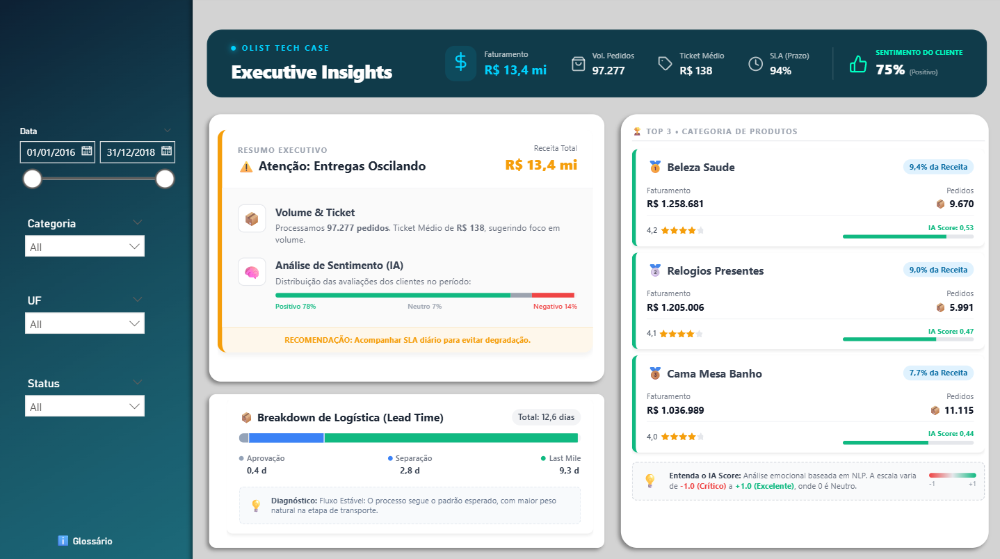
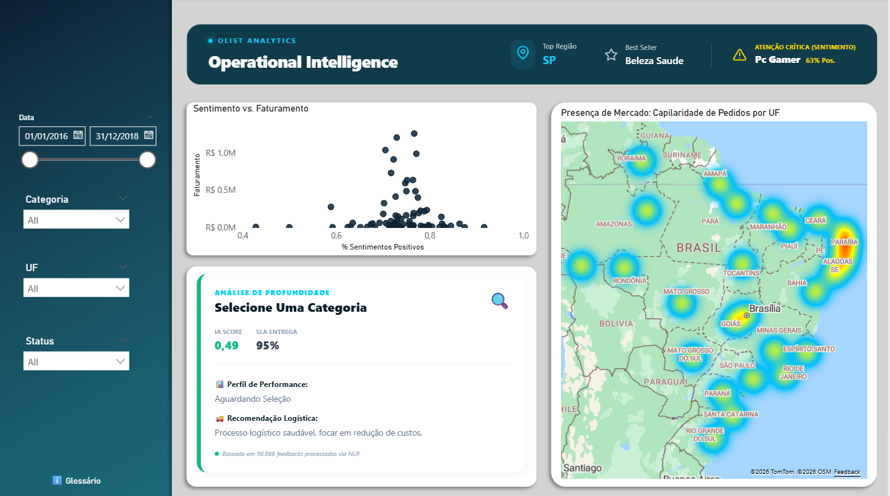

# Olist E-Commerce Analytics: Plataforma End-to-End de Inteligência de Dados

**Stack Tecnológica:** Power BI, Python (spaCy), SQL (Snowflake), Streamlit, Data Quality

---

## 🚀 Visão Geral do Projeto

Este repositório apresenta a construção de uma solução completa de Analytics para um ecossistema de e-commerce de alta volumetria, utilizando o dataset público da Olist (+100k pedidos).

O projeto demonstra a implementação de uma esteira de dados moderna, cobrindo desde a ingestão bruta até a entrega de insights prescritivos via IA e Dashboards de UX avançado.

### 📅 Arquitetura e Fluxo de Entrega
- **Planejamento:** Organização focada em infraestrutura Bronze/Silver antes da camada Gold (Modelagem).
- **Ingestão & Governança:** Processamento de Big Data com catalogação técnica e funcional para garantir a linhagem dos dados.
- **Qualidade de Dados:** Implementação de **Data Contracts** para assegurar a integridade da camada de consumo.
- **Enriquecimento com IA:** Motor de **NLP** para extração de sentimento e calibração de Ground Truth.
- **Visualização:** Modelagem Dimensional (**Star Schema**) e desenvolvimento de Data App interativo.

---

## 🕵️ Data Quality e Observabilidade (Data Contracts)

Para garantir que a tomada de decisão seja baseada em dados íntegros, implementei um pipeline de auditoria automatizada fundamentado em observabilidade, utilizando lógica inspirada no framework *Great Expectations*.

**Regras de Auditoria (Script `data_quality.py`):**
* **Consistência de Domínio:** Validação estatística para assegurar que os scores de review estejam rigorosamente entre 1 e 5.
* **Integridade Referencial:** Monitoramento de nulos em chaves primárias (PKs) para evitar "dados órfãos" e garantir a unicidade.
* **Health Check:** Geração de métricas descritivas (Min, Max, Média) em tempo real para detecção de anomalias na carga.

---

## 🤖 Engenharia de Features com IA (Advanced NLP)

O diferencial desta solução é o processamento de textos desestruturados para transformar comentários em métricas quantitativas acionáveis.

**Motor de Inferência Híbrida (`power_query_nlp.py`):**
* **NLP com spaCy:** Utilização de lematização para identificar a raiz semântica das reclamações e elogios em português.
* **Calibração de Sentimento:** Desenvolvimento do **"IA Score"**, que correlaciona a semântica do texto com a nota real deixada pelo cliente, eliminando vieses e entregando uma percepção fiel da experiência do usuário.

  

---

## 📐 Modelagem de Dados e Performance

Desenvolvi uma modelagem **Star Schema** (Fato/Dimensão) no Power BI para garantir alta performance de consulta no motor tabular.

### 🏗️ Engenharia de Analytics
1. **Governança de Dados:** Padronização rigorosa em `snake_case` e remoção de caracteres especiais para garantir interoperabilidade entre sistemas.
2. **Vertical Partitioning:** Remoção estratégica de colunas de alta cardinalidade para otimizar o consumo de memória RAM e acelerar o refresh do modelo.
3. **Type Safety:** Tratamento de locale e tipagem explícita para evitar erros de magnitude em campos monetários e geográficos.
4. **Data Enrichment:** Enriquecimento da dimensão de clientes com coordenadas exatas (Lat/Long) para análises de geointeligência.

---

## 📊 Dashboards e UX Avançado

A solução de visualização foi dividida em camadas estratégicas para atender diferentes níveis de decisão:

1. **Executive Insights:** Focado em faturamento (R$ 13,4 mi), saúde financeira e análise de gargalos logísticos via Lead Time Breakdown.
2. **Operational Intelligence:** Monitoramento tático de "Best Sellers", áreas de atenção crítica e diagnóstico automático de **Risco de Churn** baseado no sentimento.

  

**Destaques Técnicos:**
* Injeção de **HTML/SVG via DAX** para visuais de Lead Time totalmente customizados.
* Mapa de calor de alta densidade para identificação de demanda geográfica.
* Glossário de métricas integrado para garantir a governança e o entendimento do usuário final.

---

## 📱 Interactive Data Application (Streamlit)

Além do ecossistema de BI, desenvolvi um **Data App** em Python (Streamlit) para democratizar o acesso aos KPIs operacionais de satisfação.
* Filtros dinâmicos por região e categoria de produto.
* Monitoramento de NPS e comparativo de metas versus mês anterior.
* Interface mobile-friendly para consulta rápida por gestores de campo.

---

**Desenvolvido por Matheus Siqueira**
